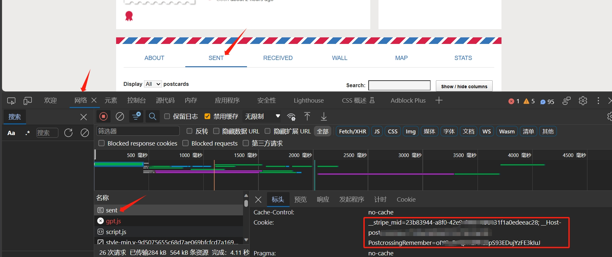

**一个可以输入account、Cookies即可获取Postcrossing gallery数据、生成个性化地图的脚本。**

个人地图展示：
[收发标记图](https://postcrossing.4a1801.life/ClusterMap.html)
[聚类图](https://postcrossing.4a1801.life/Map.html)

个人博客效果展示：
[sent](https://blog.4a1801.life/Arthur/postcrossing/sent.html)
[received](https://blog.4a1801.life/Arthur/postcrossing/received.html)

# 前言

本项目特点：
1、可以下载gallery对应的图片，并生成包含fronttage的.md文件，以便你放入到vuepress当中使用
2、可抓取对应账户的收、发明信片的信息，形成2个地图文件，内容是仿官方的map部分的谷歌地图，但是加入了自定义的内容
3、抓取后的信息会保存到./output/sent_List.json和received_List.json当中，如果以后有更新，只会抓取更新部分，减少对Postcrossing的压力。

# 一.步骤

1. clone本项目到本地，并在当前路径下运行终端
2. 将config.jsonBAK这个文件修改为config.bak

```
{
    "account": "",//输入你的个人账户,如链接：“https://www.postcrossing.com/user/arthurfsy/gallery”当中的“arthurfsy”
    "nickName": "",//输入你定义的昵称，用于生成.md文件的fronttage内容，生成后的.md文件可作为vuepress项目使用
    "Cookie": "",//通过浏览器获取的Cookies，具体获取方式见最后的备注，且cookie的有效期可能只有几个小时
    "isPrivate": "Y",//默认为Y，当Cookies正确且有效时，可以获取到gallery的favorite、popular图片以及对应账号的所有卡片详情。如果设置为N，则只能获取到gallery的sent/received图片（如果该账号隐私设置为“非公开”，则也无法获取到信息）
    "picDriverPath":"https://s3.amazonaws.com/static2.postcrossing.com/postcard/medium"//默认情况下无需修改，该路径为Postcrossing图片的官方链接前缀。
}
```

执行 `pip install -r requirements.txt安装依赖`

3. 运行以下代码获取gallery数据：

`python postcrossing.py`

注：如果account、Cookie无误的话，即可在./gallery路径下生成4个.md格式的文件，分别对应gallery当中的sent、received、favourites、popular的内容,并自动在./gallery/picture路径下保存对应的图片。

4. 运行以下代码生成地图：
   `python createMap.py`
   注：如果account、Cookie无误的话，即可在./路径下生成2个.html格式的文件，分别是ClusterMap.html和Map.html。

# 二. Github Page在线展示

**如果你想通过Github Page来在线展示地图数据，可进行以下步骤**

1. fork本项目到你自己的仓库，clone到本地后修改fork仓库内的config.jsonBAK文件名称、内容
2. 参考上述的步骤1-4，在本地生成2个地图html文件
3. 将HTML文件push到你fork的仓库当中
4. 参考以下截图开通Github Page,即可访问(需要手动在链接后面增加ClusterMap.html或Map.html)
   

# 三.备注

## 获取Cookie的方法：

1. 登陆你的postcrossing账号，并打开你个人的gallery/sent链接。
2. 按下F12打开调试模式，再F5刷新网页，在“网络/network”下找到“sent”名称的项，点击“标头”，在“请求标头”中找到Cookie开头的内容（红框当中显示的内容）。鼠标选中，复制粘贴到config.json的Cookie对应位置。（开头是类似__的内容，不要漏了）
   
3. 如果Cookies不正确，生成的favourites.md、popular.md文件是空白的。运行对应的文件也会弹出报错而中断。

## 你也可以通过vercel来接入fork的项目，这样可以在本地生成，然后每次push到GitHub后，通过vercel生成新的地图html