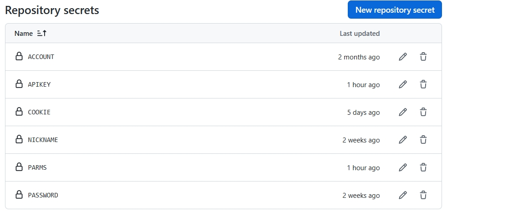
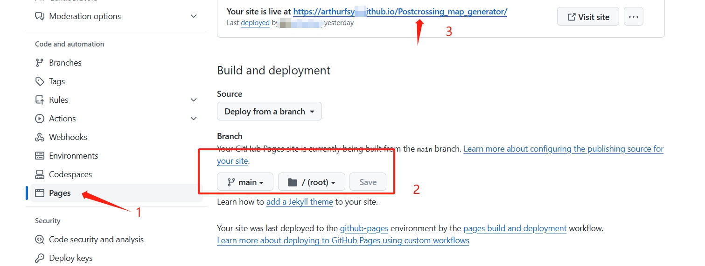

**一个可以输入account、Cookies即可获取Postcrossing gallery数据、生成个性化地图的脚本。**

个人地图展示：
[收发标记图](https://postcrossing.4a1801.life/ClusterMap.html)
[聚类图](https://postcrossing.4a1801.life/Map.html)

个人博客效果展示：
[Postcrossing](https://blog.4a1801.life/Arthur/postcrossing/信息汇总.html)

# 前言

本项目特点：

1. 可以下载gallery对应的图片，并生成包含fronttage的.md文件，以便你放入到vuepress当中使用
2. 可抓取对应账户的收、发明信片的信息，形成2个地图文件，内容是仿官方的map部分的谷歌地图，但是加入了自定义的内容
3. 可通过模板生成你个人的“信息汇总”页面
4. 当你寄出的邮件被登记后，可抓取你账号postcrossing账号的回复邮件（"Hurray! Your postcard CN-XXX to XXXX"的邮件）
5. 抓取后的信息会保存到./template/data/db数据库当中，如果以后有更新，只会抓取更新部分，减少对Postcrossing的压力。

# 环境要求

python版本 >=3.11.2

# 一. 步骤（本地模式）

1. clone本项目到本地
2. 按需修改scripts/config.json

```
{
    "account": "your account",//你的账户，通过scripts/login.py来自动赋值 “https://www.postcrossing.com/user/arthurfsy/gallery”当中的“arthurfsy”
    "nickName": "your Markdown Name",//输入你定义的昵称，用于生成.md文件的fronttage内容，生成后的.md文件可作为vuepress项目使用
    "Cookie": "auto create",//你的账户，通过scripts/login.py来自动赋值 
    "picDriverPath":"https://s3.amazonaws.com/static2.postcrossing.com/postcard/medium",//默认为Postcrossing图片的官方链接前缀。也可以在运行`python scripts/createGallery.py`后改为"./gallery/picture"，进行本地读取
    "dbpath": "./template/data.db", //默认的数据库存放路径
    "repo":"arthurfsy2/Postcrossing_map_generator" //更改为你自己的仓库名。用于“信息汇总”的echarts图标取值。
```

进入项目目录

* **删除/output、/gallery目录下的所有文件（使用你自己的账号，会自动生成数据）**
* **删除/template目录下的data.db文件（postcardStory.xlsx、信息汇总_template.md可修改为你喜欢的文字描述）**

执行 `pip install -r requirements.txt安装依赖`

执行 `pip install openpyxl -i http://pypi.doubanio.com/simple/ --trusted-host pypi.doubanio.com` 安装openpyxl （如果你需要填写/template/postcardStory.xlsx 当中的明信片背面文字内容，则需要安装）

数据获取：

依次执行以下内容：

1. 登陆账号

   `python scripts/login.py "账号" "密码" "昵称" "仓库地址"` 

   输入账号密码获取cookies，如：`python scripts/login.py "youraccount" "yourpassword" "yournickname" "yourReponame"`

2. 登陆邮箱，抓取数据（可选）

   `python scripts/mailTrack.py "邮箱host//邮箱账号//邮箱app密码//邮件对应的目录" "小牛翻译apikey" `

   抓取邮箱回复，如果你曾经有用过多个邮箱，则配置多组参数。

   如：`python scripts/mailTrack.py "imap.qq.com//254XXXX40@qq.com//hyiXXXXccaaa//其他文件夹/Postcrossing,imap.gmail.com//fsXXXX@gmail.com//ltjorXXXXmore//postcrossing" "6666XX6666"`

   **参数填写注意事项：**

   - 参数格式：不同组的配置用英文逗号隔开，组内的不同参数则通过‘//’分隔，QQ邮箱、谷歌邮箱的host可以参考以下内容，其他邮箱的host需要自行查询和调试。

   - QQ邮箱、谷歌邮箱的密码需要申请专用的app密码

     参考：

     [QQ 开启 IMAP 服务，获取 IMAP 密码（授权码） - 个人博客 (qweree.cn)](https://qweree.cn/index.php/162/)

     [谷歌邮箱（@gmail.com）：两步验证+应用专用密码登录 - 知乎 (zhihu.com)](https://zhuanlan.zhihu.com/p/483277240)

   - 参数说明：
        邮件对应的目录一般默认为“**INBOX**"，如果之前你已经将邮件挪到其他文件夹，则需要修改以下./scripts/mailTrack.py的内容，将注释去掉，然后运行`"imap.qq.com//254XXXX40@qq.com//hyiXXXXccaaa//INBOX`先查询自己账号的邮箱有哪些文件夹，然后在运行参数中修改正确为的文件夹：`"imap.qq.com//254XXXX40@qq.com//hyiXXXXccaaa//其他文件夹/postcrossing`

   ```
       with MailBox(host).login(user, passwd) as mailbox:        
           # for f in mailbox.folder.list():
           #     print(f) #查看当前账号的文件夹列表
   ```

   - 如果抓取数据时，发现无法获取邮件，请检查：是否有开通收取所有邮件的选项。

     QQ邮箱：首页设置-账号-**POP3/IMAP/SMTP/Exchange/CardDAV/CalDAV服务**-收取选项

     收取选项：**全部**

     GMAIL：设置-查看所有设置-转发和 POP/IMAP-**IMAP 访问**

     启用IMAP

     **文件夹大小限制**：不限制

3. 开始postcrossing数据抓取

   `python scripts/startTask.py "账号" "密码" "昵称" "仓库地址"` 

   如：`python scripts/login.py "youraccount" "yourpassword" "yournickname" "yourReponame"`

   运行后将会自动获取数据


重要脚本说明：

```
scripts/createMap.py  //在./生成ClusterMap.html和Map.html文件(还包含其他结果文件)
scripts/createGallery.py  //在./gallery生成4个不同类型的展示墙、已下载的图片(还包含其他结果文件)
scripts/createPersonalPage.py  //在./output生成“信息汇总”页面(还包含其他结果文件)
（可选）python scripts/init.py  //初始化config.json的信息
```

# 二. Github Action

如果你想通过Github Action来实现定时获取数据，可进行以下步骤

1. fork本项目到你自己的仓库，然后修改fork仓库内的 `.github/workflows/sync.yml`和`refreshCookie.yml`文件，以下内容改为你自己的github信息。

```
env:
  GITHUB_NAME: arthurfsy2 （修改成你的github名称）
  GITHUB_EMAIL: fsyflh@gmail.com （修改为你的github账号邮箱）
```

    默认执行时间是每天09:00（北京时间）会自动执行脚本。(Github Action是UTC时间，需要北京时间-8小时得到UTC时间，如下方的- cron: '0 1 * * *')
    
    如需修改时间，可修改以下代码的`cron`

```
on:
  workflow_dispatch:
  schedule:
    - cron: '00 1 * * *'
  push:
    branches:
      - main
```

为 GitHub Actions 添加代码提交权限 访问repo  Settings > Actions > General页面，找到Workflow permissions的设置项，将选项配置为Read and write permissions，支持 CI 将运动数据更新后提交到仓库中。
**不设置允许的话，会导致workflows无法写入文件**

在 repo Settings > Security > Secrets > secrets and variables > Actions  > New repository secret > 增加以下变量:

- account：你的postcrossing账号名称
- password：你的postcrossing账号密码
- nickname：你的vuepress的fronttage的category:- XXX 对应的名称

> 添加好后的变量如下图所示
>



# 三. Github Page在线展示

**如果你想通过Github Page来在线展示地图数据，可进行以下步骤**

1. fork本项目到你自己的仓库，clone到本地后按需修改fork后仓库内的scripts/config.json内容
2. 参考**一. 步骤（本地模式）**的步骤1-4（注意要删除掉我的数据），在本地/通过Github Action生成文件
3. 将HTML文件push到你fork的仓库当中/等待Github Action自动生成文件
4. 参考以下截图开通Github Page，即可访问(需要手动在链接后面增加ClusterMap.html或Map.html)

> 如：https://arthurfsy2.github.io/Postcrossing_map_generator/Map.html
> 也可通过vercel生成：https://postcrossingfsy.vercel.app/Map.html

   

# 四. 文件使用方法

## 1.CDN

1、成功在github仓库上获取output路径下的的json文件后，如果希望国内网络流畅访问，且对数据更新没那么敏感的话，可考虑通过CDN加速一下。

### 推荐1.jsdelivr

* 格式为：`https://cdn.jsdelivr.net/gh/你的账号名/你的仓库名@分支名称/文件名称`
  如本仓库的json链接：

```
https://cdn.jsdelivr.net/gh/arthurfsy2/Postcrossing_map_generator@main/output/calendar.json
  https://cdn.jsdelivr.net/gh/arthurfsy2/Postcrossing_map_generator@main/output/stats.json
  https://cdn.jsdelivr.net/gh/arthurfsy2/Postcrossing_map_generator@main/output/month.json
```

### 推荐2.gitmirror

可直接将 `raw.githubusercontent.com/XXX`换成 `raw.gitmirror.com/XXX`，即可实现免费CDN

```
https://raw.gitmirror.com/arthurfsy2/Postcrossing_map_generator/main/output/calendar.json

https://raw.gitmirror.com/arthurfsy2/Postcrossing_map_generator/main/output/stats.json

https://raw.gitmirror.com/arthurfsy2/Postcrossing_map_generator/main/output/month.json
```

上述2种方法获取的json文件为直链，可以通过python或javascript直接http的get请求，直接获取到数据。

> 本项目的“信息汇总.md"关于echarts图表部分，则用到了几个json文件的CDN链接。


## 2.自动将.md同步到vuepress仓库


步骤：

1、在你的vuepress仓库的src/.vuepress/public/scripts/路径下新建updatePostcrossing.py，脚本内容可参考：[updatePostcrossing.py](https://github.com/arthurfsy2/arthurfsy2.github.io/blob/main/src/.vuepress/public/scripts/updatePostcrossing.py)

修改以下代码的`arthurfsy2/Postcrossing_map_generator`为你自己的仓库名称（地址已采用了jsdelivr的CDN链接）：

```
def downloadMD(type):
    if type != '信息汇总':
        url = f"https://cdn.jsdelivr.net/gh/arthurfsy2/Postcrossing_map_generator@main/gallery/{type}.md"
    else:
        url = f"https://cdn.jsdelivr.net/gh/arthurfsy2/Postcrossing_map_generator@main/output/{type}.md"
```


2、在你的vuepress仓库的workflows路径下新建updatePostcrossing.yml，脚本内容可参考：[updatePostcrossing.yml](https://github.com/arthurfsy2/arthurfsy2.github.io/blob/main/.github/workflows/updatePostcrossing.yml)

以下内容改为你自己的github信息。

这样就可以将你的Postcrossing脚本仓库生成的文件，在固定的时间段通过Github Action下载到你的vuepress仓库当中（如果有更新的话）

```
env:
  GITHUB_NAME: arthurfsy2 （修改成你的github名称）
  GITHUB_EMAIL: fsyflh@gmail.com （修改为你的github账号邮箱）
```

# 五. 其他说明

## vercel

你也可以通过vercel来接入fork的项目，这样可以在本地生成，然后每次push到GitHub后，通过vercel生成新的地图html

## emoji

在.md的文件中，新增了国家2位英文代码对应的emoji表情（在不同平台看到的效果可能不一样）
注：大部分是通过简写代码标注，少部分国家和地区是通过十六进制HTML字符实体标注。如果发现某个国家的国旗emoji表情无法正常显示（如显示:xxx:，则说明这个国家没有简码/设置不正确）

修改步骤：

1. 通过这个网址查询到对应的国家或地区：https://emojidaquan.com/category2-country-flags
2. 找到对应的国家或地区，如香港：https://emojidaquan.com/emoji-flag-for-hong-kong
3. 查询简写代码、或十六进制HTML字符实体，填写到 `scripts/contryNameEmoji.json`文件中。（如果是十六进制HTML字符实体，则复制粘贴后需要去除中间的空格。如香港的是"&#x1f1ed\;&#x1f1f0\;"
4. 修改保存后，获取新的Cookie填入scripts/config.json，然后重新执行py postcrossing.py
