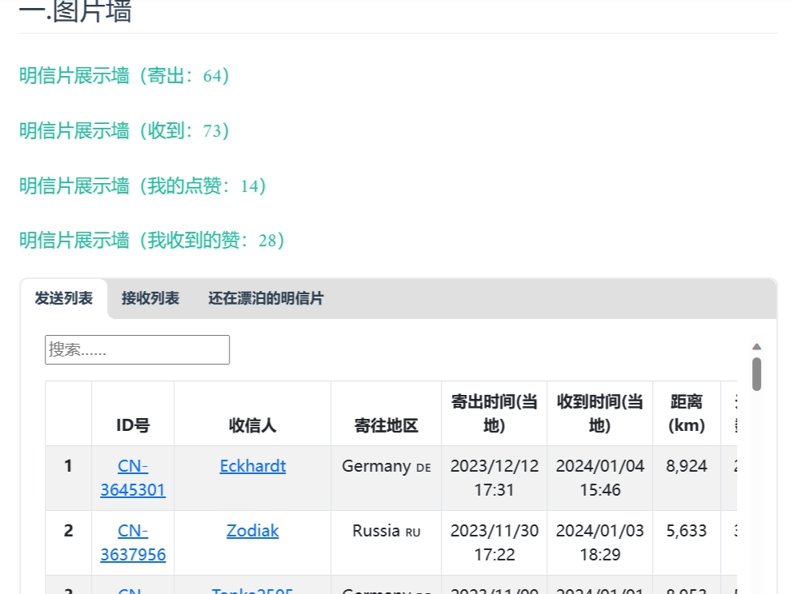

**一个可以输入 postcrossing 账号、密码，即可获取展示墙数据、生成个性化地图、各种数据统计的脚本（数据收集癖患者的福音），是官网的 plus 加强版+美化版。**

个人地图展示：
[收发标记图](https://postcrossing.4a1801.life/ClusterMap.html)
[聚类图](https://postcrossing.4a1801.life/Map.html)

个人博客效果展示：
[Postcrossing](https://blog.4a1801.life/Arthur/postcrossing/信息汇总.html)

# 前言

本项目特点：

1. 展示墙
   抓取官网的 `/gallery`下的 4 个模块，下载 gallery 对应的图片，并生成包含 fronttage 的.md 文件，以便你放入到**vuepress**当中使用
2. 地图
   参考官网的 `/map`的样式，通过 ClusterMap、Map 这 2 个地图分别展示了聚合效果、散点展示效果，且每个地图都通过 Geojson 来标记收发国家的“足迹”。
3. **信息汇总**：

   汇总以下模块的内容

   - 基本信息：统计个人收发数据、自我介绍、定位地图
     
   - 图片墙：对应 4 个展示墙的超链接、收/发/traveling 列表
     
   - 地图展示：集成 `map.html、clusterMap.html`这 2 个地图的内容
     
   - 统计

     抓取官网的 `/stats`下的 3 个模块，分别展示 `收发记录（年、月）`、`国家分布（饼图）`、`各国明信片（表格）`

     > 图形是通过 echarts 插件显示，表格是通过 markdown 的表格实现。）

     

     

   - 明信片故事：读取人工填写的 `./temnplate/postcardStory`生成明信片故事的**词云**，并为每个已填写“故事”的明信片展示图片、内容

     

     

   - 被注册时收到的回复

     当你寄出的邮件被登记后，可定时抓取你账号 postcrossing 账号关联邮箱的**回复邮件内容**（"Hurray! Your postcard CN-XXX to XXXX"的邮件）

     

   - 增量更新

     抓取后的信息会保存到./template/data/db 数据库当中，如果以后有更新，只会抓取更新部分并存入到数据库，减少对 Postcrossing 的压力。

# 环境要求

python 版本 >=3.11.2

# 一. 部署步骤（本地模式）

## 初始化

1. clone 本项目到本地
2. 按需修改 scripts/config.json

```
{
    "Cookie": "auto create",//正常情况下无需修改。通过scripts/login.py或startTask.py来自动赋值
    "picDriverPath":"https://raw.gitmirror.com/$repo/main/gallery/picture",//展示墙图片默认为Github仓库的文件直链。也可以在运行`python scripts/createGallery.py`后改为"./gallery/picture"，进行本地读取。如果是本地使用，需要改为./gallery/picture
    "storyPicLink": "https://raw.gitmirror.com/$repo/main/template/content", //存放明信片背面图片的路径。如果是本地使用，需要改为./template/content
    "storyPicType": "webp", //存放明信片背面图片的格式
    "dbpath": "./template/data.db", //默认的数据库存放路径
    "personalPageLink":"https://XXXX" //信息汇总页用途，填写你的github page 路径，如“https://XXX/output/sent.html”，则取地址的前半截

}
```

3. 进入项目目录

- **删除./output、./gallery 目录下的所有文件（使用你自己的账号，会自动生成数据）**
- **删除./template 目录下的 data.db 文件**
- **（可选）修改**：在./template/postcardStory.xlsx 中填入已收到明信片的文字、信息汇总\_template.md 可修改为你喜欢的文字描述）
- **（可选）修改**：在 `./template/content/`目录下删除我的数据，然后拍照复制（建议扫描全能王自动切边+自动高清）已收到明信片的文字面图片到`./template/content/rawPic`目录下，可以自动转换为 webp 格式。并将图片名称命名为 ID 名称，如：`CN-XXXXXXX.webp`。
  （本项目图片默认读取 webp 格式，如果需要修改为其他格式，需要修改./scripts/config.json 文件中的“storycontentPicType"的值，改为你需要的格式
- **（可选）修改/删除**：在 `./template/信息汇总_template.md/`文件的“网址备份”内容，改为你自己生成的文件链接

4. 执行 `pip install -r requirements.txt安装依赖`
5. 执行 `pip install openpyxl -i http://pypi.doubanio.com/simple/ --trusted-host pypi.doubanio.com` 安装 openpyxl （如果你需要填写/template/postcardStory.xlsx 当中的明信片背面文字内容，则需要安装）

## 数据获取

重要脚本说明：

```
（1）一键脚本：
scripts/startTask.py //本脚本已整合了所有需要运行的文件，运行后可一键生成项目所有文件
```

执行`python scripts/startTask.py "postcrossing账号" "postcrossing密码" "你想要在vuepress中展示的昵称" "仓库地址" "小牛翻译apikey"`

```
（2）各步骤脚本
1) scripts/login.py  //登陆账号获取cookie，可单独使用（配合Github Action定时刷新Cookie），也可以整合到startTask.py中使用
2) scripts/multiDownload.py //下载/更新内容到数据库
3) scripts/createMap.py  //在根目录生成ClusterMap.html、Map.html、Location.html文件
4) scripts/createGallery.py  //在`./gallery`生成4个不同类型的展示墙、已下载的图片
5) scripts/createPersonalPage.py  //在`./gallery`生成“信息汇总”页面(还包含其他结果文件)
6) scripts/mailTrack.py  //在`./template/data.db`数据库中插入已抓取到的邮件回复信息
```

如果你需要人工进行数据获取/单独调试某模块内容，可参考以下执行顺序：

1. 登陆账号

   `python scripts/login.py "postcrossing账号" "postcrossing密码"`

   输入 postcrossing 账号密码获取 cookies，如：`python scripts/login.py "youraccount" "yourpassword"`

2. 登陆邮箱，抓取数据（可选）

   `python scripts/mailTrack.py "邮箱host//邮箱账号//邮箱app密码//邮件对应的目录" "小牛翻译apikey" `

   抓取邮箱回复，如果你曾经有用过多个邮箱，则配置多组参数。

   如：`python scripts/mailTrack.py "imap.qq.com//254XXXX40@qq.com//hyiXXXXccaaa//其他文件夹/Postcrossing,imap.gmail.com//fsXXXX@gmail.com//ltjorXXXXmore//postcrossing" "6666XX6666"`

   **参数填写注意事项：**

   - QQ 邮箱、谷歌邮箱的密码需要申请专用的 app 密码

     参考：

     [QQ 开启 IMAP 服务，获取 IMAP 密码（授权码） - 个人博客 (qweree.cn)](https://qweree.cn/index.php/162/)

     [谷歌邮箱（@gmail.com）：两步验证+应用专用密码登录 - 知乎 (zhihu.com)](https://zhuanlan.zhihu.com/p/483277240)

   - 参数说明：

     不同组的配置用英文逗号隔开，组内的不同参数则通过‘//’分隔，QQ 邮箱、谷歌邮箱的 host 可以参考以下内容，其他邮箱的 host 需要自行查询和调试。

     邮件对应的目录一般默认为“**INBOX**"，如果之前你已经将邮件挪到其他文件夹，则需要修改以下./scripts/mailTrack.py 的内容，将注释去掉，然后使用邮箱参数 `"imap.qq.com//254XXXX40@qq.com//hyiXXXXccaaa//INBOX`先查询自己账号的邮箱有哪些文件夹，然后在运行参数中修改正确为的文件夹：`"imap.qq.com//254XXXX40@qq.com//hyiXXXXccaaa//其他文件夹/postcrossing`

   ```
       with MailBox(host).login(user, passwd) as mailbox:
           # for f in mailbox.folder.list():
           #     print(f) #查看当前账号的文件夹列表
   ```

   - 小牛翻译 API：用于翻译回复邮件的内容，官网：niutrans.com，注册登陆后，可通过[小牛翻译控制台 (niutrans.com)](https://niutrans.com/cloud/account_info/info)右边的**API-KEY**即可
   - 如果抓取数据时，发现无法获取邮件，请检查：是否有开通收取所有邮件的选项。

     **QQ 邮箱**：首页设置-账号-**POP3/IMAP/SMTP/Exchange/CardDAV/CalDAV 服务**-收取选项

     收取选项：**全部**

     **GMAIL**：设置-查看所有设置-转发和 POP/IMAP-**IMAP 访问**

     启用 IMAP

     **文件夹大小限制**：不限制

3. 更新/下载数据，集成到数据库
   `python scripts/multiDownload.py "postcrossing账号" "postcrossing密码" "你想要在vuepress中展示的昵称" "仓库地址"`

   如：`python scripts/multiDownload.py "youraccount" "yourpassword" "yournickname" "yourReponame"`

4. 生成展示墙

   `python scripts/createGallery.py "postcrossing账号" "你想要在vuepress中展示的昵称" "仓库地址"`

   如：`python scripts/createGallery.py "youraccount" "yournickname" "yourReponame"`

5. 生成地图

   `python scripts/createMap.py "postcrossing账号"`

   如：`python scripts/createMap.py "youraccount"`

6. 生成信息汇总页
   "postcrossing 账号" "postcrossing 密码" "你想要在 vuepress 中展示的昵称" "仓库地址" "小牛翻译 apikey"
   `python scripts/createPersonalPage.py "postcrossing账号" "你想要在vuepress中展示的昵称" "仓库地址" "小牛翻译apikey"`

   如：`python scripts/createPersonalPage.py "youraccount" "yournickname" "yourReponame" "apikey"`

# 二. Github Action

如果你想通过 Github Action 来实现定时获取数据，可进行以下步骤

1. fork 本项目到你自己的仓库，然后修改 fork 仓库内的 `.github/workflows/sync.yml`和 `refreshCookie.yml`文件，以下内容改为你自己的 github 信息。

```
env:
  GITHUB_NAME: arthurfsy2 （修改成你的github名称）
  GITHUB_EMAIL: fsyflh@gmail.com （修改为你的github账号邮箱）
```

    默认执行时间是每天09:00（北京时间）会自动执行脚本。(Github Action是UTC时间，需要北京时间-8小时得到UTC时间，如下方的- cron: '0 1 * * *')

    如需修改时间，可修改以下代码的`cron`

```
on:
  workflow_dispatch:
  schedule:
    - cron: '00 1 * * *'
  push:
    branches:
      - main
```

2. 为 GitHub Actions 添加代码提交权限 访问 repo Settings > Actions > General 页面，找到 Workflow permissions 的设置项，将选项配置为 Read and write permissions，支持 CI 将运动数据更新后提交到仓库中。
   **不设置允许的话，会导致 workflows 无法写入文件**
3. 在 repo Settings > Security > Secrets > secrets and variables > Actions > New repository secret > 增加以下变量:

- account：你的 postcrossing 账号名称
- password：你的 postcrossing 账号密码
- nickname：你的 vuepress 的 fronttage 的 category:- XXX 对应的名称
- parm：邮件参数，如："imap.qq.com//254XXXX40@qq.com//hyiXXXXccaaa//其他文件夹/Postcrossing,imap.gmail.com//fsXXXX@gmail.com//ltjorXXXXmore//postcrossing" （说明详见步骤一）
- apikey：小牛翻译的 api

> 添加好后的变量如下图所示


    注意：

    如果不需要登陆账号搜集回复内容，请将`.github/workflows/sync.yml`中的以下内容注释掉，或者删除。

```
- name: 更新邮件回复
        run: |
          python scripts/mailTrack.py ${{ secrets.PARMS }} ${{ secrets.APIKEY }}
```

4. 将修改后的内容上传/push 到 Github 当中

# 三. Github Page 在线展示

**如果你想通过 Github Page 来在线展示地图数据，可进行以下步骤**

1. fork 本项目到你自己的仓库，clone 到本地后按需修改 fork 后仓库内的 scripts/config.json 内容
2. 参考**一. 步骤（本地模式）**的步骤 1-4（注意要删除掉我的数据），在本地/通过 Github Action 生成文件
3. 将 HTML 文件 push 到你 fork 的仓库当中/等待 Github Action 自动生成文件
4. 参考以下截图开通 Github Page，即可访问(需要手动在链接后面增加 ClusterMap.html 或 Map.html)

> 如：https://arthurfsy2.github.io/Postcrossing_map_generator/Map.html
> 也可通过 vercel 生成：https://postcrossingfsy.vercel.app/Map.html


# 四. 文件使用方法

## 1. Github 文件直链

类似：`raw.githubusercontent.com/XXX`格式

> 经实测，Github 之间的仓库进行`request.get()`时，还是用 Github 自己的直链比较好，其他国内 CDN 会出现更新不及时的情况（get 的是缓存的数据）。

## 2. CDN

1、成功在 github 仓库上获取 output 路径下的的 json 文件后，如果希望国内网络流畅访问，且对数据更新没那么敏感的话，可考虑通过 CDN 加速一下。

### 推荐 1.jsdelivr

- 格式为：`https://cdn.jsdelivr.net/gh/你的账号名/你的仓库名@分支名称/文件名称`
  如本仓库的 json 链接：

```
https://cdn.jsdelivr.net/gh/arthurfsy2/Postcrossing_map_generator@main/output/calendar.json
  https://cdn.jsdelivr.net/gh/arthurfsy2/Postcrossing_map_generator@main/output/stats.json
  https://cdn.jsdelivr.net/gh/arthurfsy2/Postcrossing_map_generator@main/output/month.json
```

### 推荐 2.gitmirror

可直接将 `raw.githubusercontent.com/XXX`换成 `raw.gitmirror.com/XXX`，即可实现免费 CDN

```
https://raw.gitmirror.com/arthurfsy2/Postcrossing_map_generator/main/output/calendar.json

https://raw.gitmirror.com/arthurfsy2/Postcrossing_map_generator/main/output/stats.json

https://raw.gitmirror.com/arthurfsy2/Postcrossing_map_generator/main/output/month.json
```

上述 2 种方法获取的 json 文件为直链，可以通过 python 或 javascript 直接 http 的 get 请求，直接获取到数据。

> 本项目的“信息汇总.md"关于 echarts 图表部分，则用到了几个 json 文件的 CDN 链接。

## 3. 自动将`.md` 同步到 vuepress blog 仓库

可以将你的 Postcrossing 脚本仓库（**仓库 A**）生成的文件，自动同步到 vuepress blog 仓库（**仓库 B**）

> PS: 其他支持 md 格式的 blog 也可以使用

### 步骤：

1、参考**仓库 A**的 .github/workflows/sync.yml
[sync.yml](https://github.com/arthurfsy2/Postcrossing_map_generator/blob/main/.github/workflows/sync.yml)

以下代码为重要部分，需要修改为你自己的信息（NAME、EMAIL 如果在上述步骤设置过的话可以不需要再设置了）。

```
env:
  GITHUB_NAME: arthurfsy2 （修改成你的github名称）
  GITHUB_EMAIL: fsyflh@gmail.com （修改为你的github账号邮箱）
  blog_path: "./src/Arthur/postcrossing"  //修改为你的blog仓库需要存放md文件的路径
  blog_repo: "git@github.com:arthurfsy2/arthurfsy2.github.io.git" //修改为你的blog仓库clone的地址（git开头的，不是https那个）
  PUSH_TO_GITHUB: true  //初始默认值，不需要改变

```

2. 在 repo Settings > Security > Secrets > secrets and variables > Actions > New repository secret > 增加以下变量:`DEPLOY_PRIVATE_KEY`,这个参数的值是需要本地生成 SSH

> 整体思路（重要）：生成 SSH 密钥-->添加到 A 仓库的 Actions 变量(用来提交）-->添加到 B 仓库的[SSH and GPG keys](https://github.com/settings/keys)（用来验证）

具体可参考以下链接。
[Mac 中 git ssh 配置](https://www.jianshu.com/p/0a41903252a3)
[用 Github 实现组件自动发布](http://www.manongjc.com/detail/62-vdxpqplyccfhosu.html)

```
- name: 推送到博客仓库
        uses: s0/git-publish-subdir-action@develop
        env:
          REPO: ${{ env.blog_repo }}
          BRANCH: main //推送的分支是main
          FOLDER: ${{ env.blog_path }} //指定A仓库的推送目录
          SSH_PRIVATE_KEY: ${{ secrets.DEPLOY_PRIVATE_KEY }}  //读取已添加的SSH密钥
          TARGET_DIR: ${{ env.blog_path }} //指定B仓库的接收目录
          MESSAGE: "已更新/src/Arthur/Postcrossing文件"
          SKIP_EMPTY_COMMITS: true //如果没有变动，则忽略，不提交
          CLEAR_GLOBS_FILE: "scripts/.clear-target-files" //用于定义清除B仓库目标分支时要删除的文件。（由scripts/.clear-target-files这个文件控制，感叹号前缀为不清理）
```

# 五. 其他说明

## vercel

你也可以通过 vercel 来接入 fork 的项目，这样可以在本地生成，然后每次 push 到 GitHub 后，通过 vercel 生成新的地图 html
